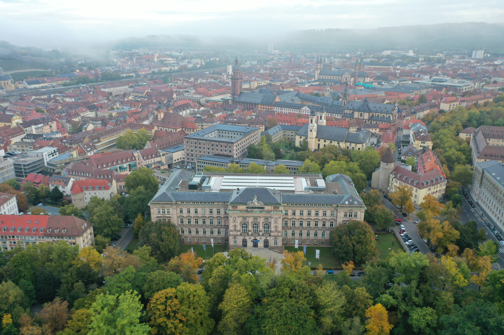
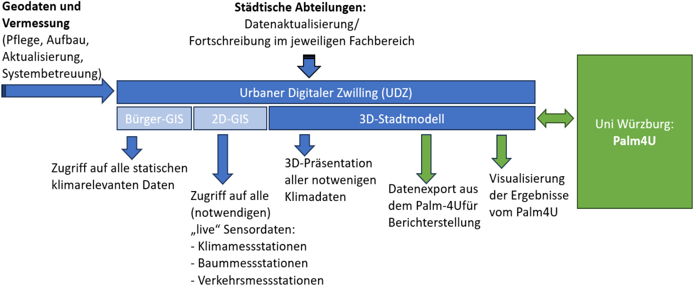



    


> Welchen stadtklimatischen Einfluss hätte die Transformation eines innerstädtischen Parkplatzes in einen Stadtpark?

# SMART-TWIN: KI-gestütztes Planungstool für eine klimaangepasste grüne Stadtentwicklung in Bayern

### Die Klimaresilienz gewinnt in der modernen Stadtplanung zunehmend an Bedeutung. Im Projekt SMART-TWIN wird für die Stadt Würzburg ein innovatives digitales Planungstool mit integriertem Stadtklimamodell entwickelt, das stadtklimatische Bewertungen in der Stadt- und Bauleitplanung für Planungsbüros zeit- und kosteneffizient, flexibel und nutzerfreundlich ermöglicht, während es zukünftige klimatische Bedingungen berücksichtigt.

Städtische Siedlungsräume besitzen eine besonders hohe Vulnerabilität gegenüber den Folgen des menschgemachten Klimawandels. Die städtische Wärmeinsel überlagert sich mit den Erwärmungsmustern des regionalen Klimawandels, während historisch gewachsene Stadtstrukturen, hohe Bebauungs- und Bevölkerungsdichte sowie die Erfordernisse der Nachverdichtung nur limitierte Handlungsspielräume bieten. Gemäß § 1 ff BauGB sind Städte bereits heute rechtlich verpflichtet, Maßnahmen für Klimaschutz und Klimaanpassungen in der Bauleitplanung zu integrieren.

Bisher beauftragen kommunale Dienststellen für stadtklimatische Bewertungen geplanter Maßnahmen häufig Planungsbüros, die als KMU in der Region tätig sind. Als Grundlage dienen meist statische, oft veraltete Klimafunktionskarten und einfache GIS-basierte Modellierungen. Die externe Vergabe solcher Gutachten an wenige, nicht in Bayern ansässige Unternehmen verzögert Entscheidungsprozesse um viele Monate und verursacht hohe Kosten für bayerische KMU, Kommunalunternehmen und Kommunen.

Das Projekt **SMART-TWIN** wird durch den Europäischen Fonds für regionale Entwicklung (EFRE) im Rahmen der Maßnahmenart 3.2 "Förderung des Technologietransfers von Hochschulen in Unternehmen" gefördert. Die Julius-Maximilians-Universität Würzburg entwickelt gemeinsam mit der Stadt Würzburg und 19 kooperierenden KMU ein vielseitiges, praxistaugliches und nutzerfreundliches KI-gestütztes Entscheidungstool für die nachhaltige Bauleit- und Stadtplanung. Das fortschrittliche Stadtklimamodell PALM-4U wird als neuartiges Zusatzmodul im vorhandenen digitalen Zwilling (DZ) der Stadt Würzburg integriert.

Dieser Ansatz ist besonders vielversprechend, da die Stadt Würzburg bereits über einen datenintensiven digitalen Zwilling verfügt, der praktisch alle statischen Inputdaten für das datenbedürftige Stadtklimamodell PALM-4U bereitstellen kann. Zudem existiert in Würzburg ein beispielloses Messnetz von städtischen Klimastationen, die seit 2018 einen lückenlosen Datensatz zur Validierung und Adjustierung des Stadtklimamodells bereitstellen. Moderne KI- und Big-Data-Technologien werden mit zeitgemäßen Ansätzen der Fernerkundung (Drohnen-Befliegungen, Satellitendaten) und der Prozessmodellierung kombiniert.

*Luftaufnahme des Residenzgebäudes*

Ein völlig neuartiger Ansatz ist die Integration mehrerer kombinierbarer Ebenen von Szenarien: Wetterlagen, die für Wohlbefinden und Gesundheit der städtischen Bevölkerung relevant sind (Hitzetage, Tropennächte, Starkniederschläge), zukünftige Entwicklungen durch Treibhausemissionen, sowie Veränderungen in der städtischen Baustruktur und Landnutzung. KMU können über ein nutzerfreundliches Interface selbstständig Berechnungen starten – beispielsweise welchen stadtklimatischen Einfluss die Transformation eines vollversiegelten Parkplatzes in einen Stadtpark unter Annahme eines sommerlichen Hitzeereignisses in der Mitte des 21. Jahrhunderts hätte.

Würzburg bietet sich als Fallbeispiel an: Der unterfränkische Raum gilt als Hotspot des Klimawandels in Mitteleuropa, und das Stadtgebiet ist aufgrund seiner Lage im Talkessel, der historisch hohen Bebauungsdichte und vielfach verbauter Flurwindschneisen durch eine besonders ausgeprägte städtische Wärmeinsel gekennzeichnet. Das entwickelte Tool wird so umgesetzt, dass es nach der Förderphase (2025-2028) leicht auf andere bayerische Städte übertragen werden kann, die bereits über einen digitalen Zwilling oder eine umfassende Datenbank zur Siedlungsstruktur verfügen.

> Wie wirkt sich eine Dachbegrünung auf die nächtliche Abkühlung im Stadtquartier aus?

## Schematische Darstellung des Projekts

*Struktur des exitstierenden Urbanen Digitalen Zwillings der Stadt Würzburg und geplante Integration des Stadtklimamodells PALM-4U.*

# Neuigkeiten

Hier finden Sie die neuesten drei Ankündigungen des Projekts.
Eine Übersicht über alle Neuigkeiten gibt es [hier](/neuigkeiten.html).




    


[Mehr Neuigkeiten anzeigen](/neuigkeiten.html)
